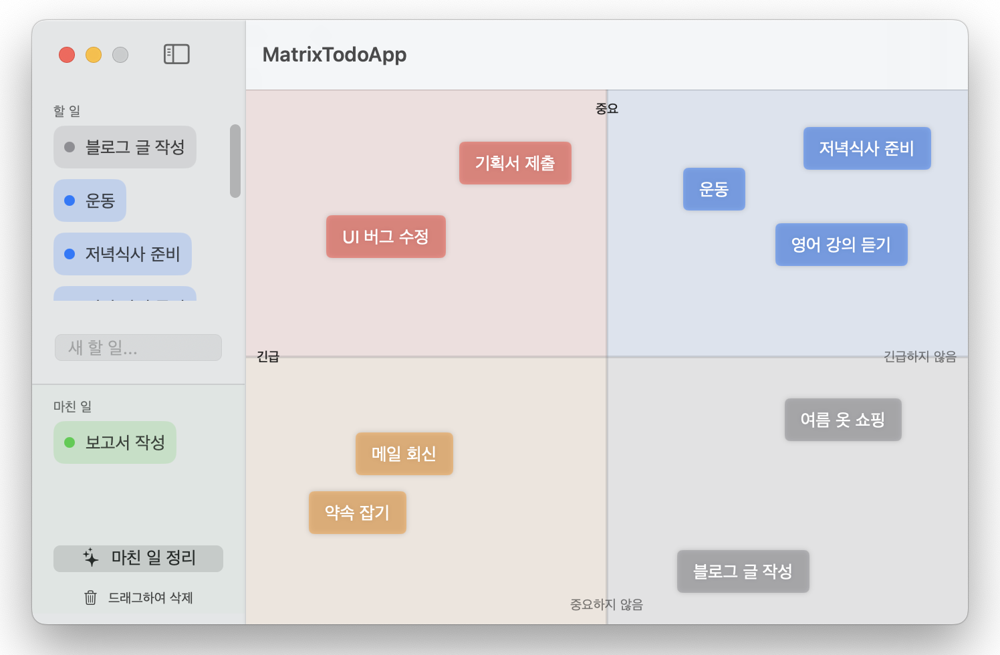

# Matrix Todo App

> **중요도와 긴급도를 기준으로 업무를 파악하기 쉽게 배치하고 효율적으로 관리할 수 있도록 돕는 앱**

 

### 🎯 주요 기능

- **사분면 캔버스로 업무 관리**: 중요도와 긴급도를 축으로 하는 사분면에 할 일을 배치하여 관리할 수 있습니다.
- **드래그 앤 드롭으로 자유로운 배치**: 리스트에서 캔버스로 할 일을 드래그하여 원하는 위치에 자유롭게 배치할 수 있습니다.
- **색상을 통한 우선도 파악**: 배치된 할 일은 우선도에 따라 색상이 변경되어 우선하여 처리해야 할 일을 파악할 수 있습니다.
- **데이터 유지**: 앱을 종료해도 모든 데이터가 JSON 형식으로 로컬에 안전하게 저장됩니다.

---

## 🛠 Tech Stack

- **Language**: Swift 5
- **Platform**: macOS 15.0+ (SwiftUI)
- **AI-Assist**: Gemini 3

---

### 참고사항

- 완료된 할 일은 최대 50개까지 자동 저장되며, 초과 시 가장 오래된 기록부터 정리됩니다.
